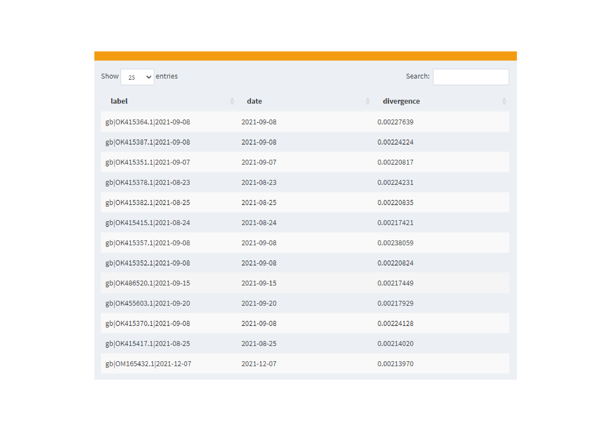
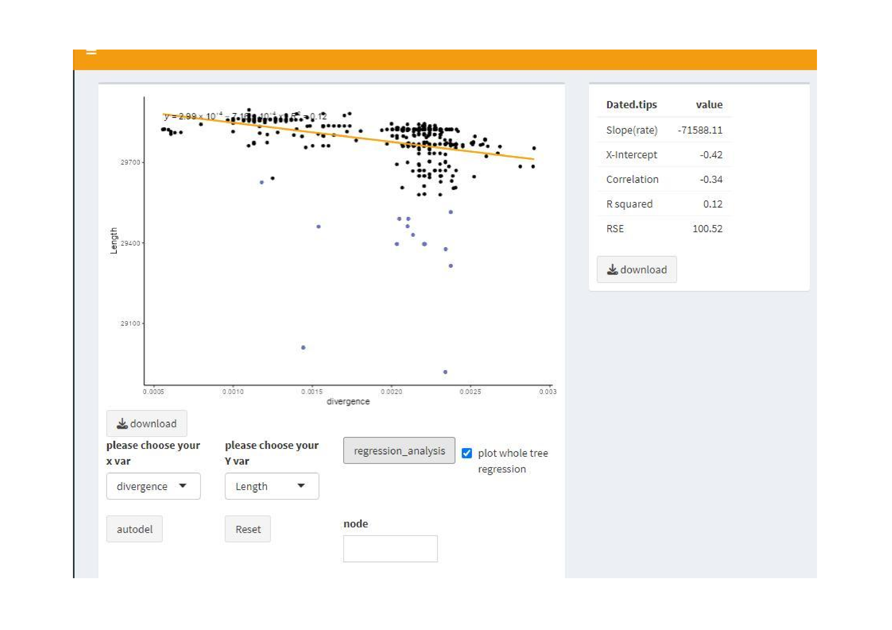

```{r include=FALSE}
knitr::opts_chunk$set(warning = FALSE,
                      message = TRUE)
library(yulab.utils)                  
```

## Introduction

Detecting temporal signals of a phylogenetic tree is crucial for estimating divergence times and ccan also serve as a data quality control measure before applying molecular clock models. The `r CRANpkg("shinyTempSignal")` package implemntes temporal signal analysis under both strict and relaxed molecular clock assumptions and allows exploring temporal signals across the entire tree as well as within different lineages. 

ShinyTempSignal allows regression analysis of various types of data, including measurable biological traits and statistical values obtained from evolutionary analysis. Such a versatile regression analysis is highly beneficial for discovering potential evolutionary patterns and addressing biological questions.

Implementing using R shiny, `r CRANpkg("shinyTempSignal")` provides an interactive interface that allows users to visualize analysis results in real-time and explore data easily. 


If you use `r CRANpkg('shinyTemnpSignal')` in published research, please cite the following paper:


+ L Zhan<sup>#</sup>, X Luo<sup>#</sup>, W Xie<sup>#</sup>, XA Zhu<sup>#</sup>, Z Xie, J Lin, L Li, W Tang, R Wang, L Deng, Y Liao, B Liu, Y Cai, Q Wang, Shuangbin Xu<sup>\*</sup>, __G Yu__<sup>\*</sup>. *shinyTemnpSignal*: an R shiny application for exploring temporal and other phylogenetic signals. __*Journal of Genetics and Genomics*__. 2024.


## Installation

`r CRANpkg('shinyTemnpSignal')` is available in CRAN and user can use the following command to install it:

```{r eval=FALSE}
install.packages("shinyTempSignal")
```


## Run the shiny application

After loading the package, users can use the ` run_shinyTempSignal()` command to launch the shiny application.


```{r eval=FALSE}
library(shinyTemnpSignal)
run_shinyTempSignal()
```

## Interactive Web Interface


### Tree structure exploration panel

{width=100%}

### Sample date panel

{width=100%}


### Temporal signal panel

{width=100%}


### Phylogenetic signal panel

{width=100%}

